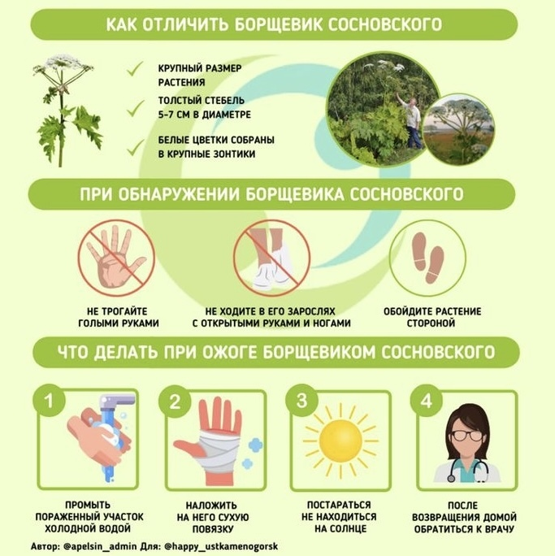

Уважаемые садоводы, в нашем садоводстве все чаще встречается растение Борщевик Сосновского. 
Необходимо контролировать его рост и не допустить распространения на новые территории. 
Избавиться от борщевика очень сложно. Начинать борьбу надо в мае, еще до цветения.
По ссылке можно ознакомиться с рекомендациями от [РОССЕЛЬХОЗНАДЗОРА](https://fsvps.gov.ru/ru/fsvps/news/36717.html).

Если вы увидели в местах общего пользования или на участках Борщевик просьба сообщить в правление
