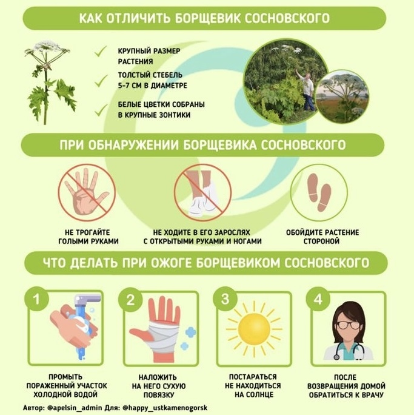

### ⚠️ Борщевик в СНТ — меры борьбы

Уважаемые садоводы!  
В нашем садоводстве всё чаще встречается опасное растение — **Борщевик Сосновского**.

🚫 Избавиться от борщевика очень сложно. Он быстро распространяется, вытесняя местную флору и угрожая здоровью.  
🔍 Борьбу необходимо начинать **в мае, до цветения**, пока растение не успело дать семена.

<!-- Ссылка на рекомендации Россельхознадзора сохранена для последующего использования -->
📌 По ссылке можно ознакомиться с официальными рекомендациями:

📝 Краткое содержание рекомендаций:
- Борьбу необходимо начинать ранней весной.
- Наиболее эффективно: выкапывание корней, регулярное скашивание до цветения.
- Участки с борщевиком нужно обозначить и контролировать повторный рост.
- Важно соблюдать меры безопасности — сок растения вызывает ожоги.

👉 [Рекомендации Россельхознадзора](https://fsvps.gov.ru/ru/fsvps/news/36717.html)

Если вы заметили Борщевик на участках или в местах общего пользования —  
**обязательно сообщите в правление СНТ!**
