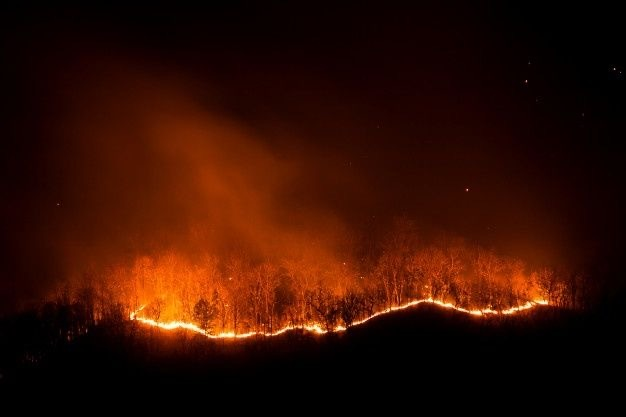

На период действия особого противопожарного режима вводятся дополнительные требования пожарной безопасности, ограничивается посещение лесов.

Устанавливаются дополнительные запреты, в том числе на:

- разведение костров на территориях поселений и городских округов, садоводческих, огороднических и дачных некоммерческих объединений граждан;
- сжигание мусора, стерни, пожнивных и порубочных остатков, сухой растительности, листвы и камыша;
- проведение неконтролируемых отжигов сухой растительности, а также пожароопасных работ;
- несанкционированные свалки твердых бытовых и горючих отходов.

Также стоит учитывать, что из-за сложившихся климатических условий в Ленинградской области ухудшается лесопожарная обстановка и увеличивается риск возникновения чрезвычайных ситуаций, связанных с переходом огня на населённые пункты и объекты экономики.

__Соблюдайте правила пожарной безопасности!__

