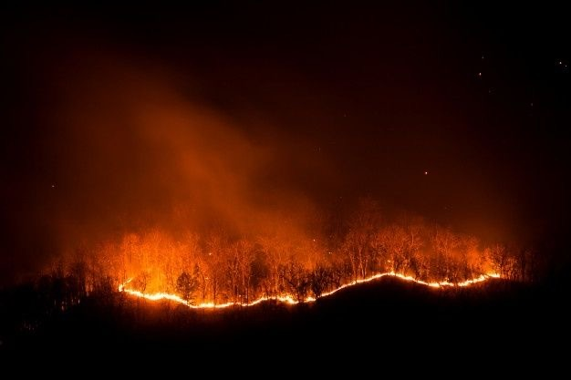

По информации «Ленинградской областной противопожарно-спасательной службы», ежегодно в весенне-летний период значительно увеличивается количество пожаров. Основные причины пожаров – неосторожное обращение с огнем:

- сжигание сухой травы,
- разведение костров,
- неосторожность при курении,
- при обращении с бытовыми электрическимиприборами.

Напоминаем, основные Правила, которые должны соблюдать садоводы на своих участках:

1. Запрещается использовать противопожарные расстояния между зданиями и сооружениями для хранения мусора (в том числе травы и бытовых отходов), материалов, оборудования и тары.

2. Сжигать мусор, траву, опавшую листву, отходы, продукты и материалы вне специально оборудованных мест. Предусмотрено, что костер можно разжигать в специальных углублениях (ямах, траншеях) в земле глубиной не менее 0,3 метра и шириной не более 1 метра. Необходимо оборудовать специальную площадку, на которой устанавливаются металлические емкости (бочки, мангалы, емкости) из негорючих материалов объемом не более 1куб.м. При использовании открытого огня для сжигания мусора расстояние до домов и других построек должно быть не менее 15 метров. Сжигание сухой травы, веток и других легковоспламеняющихся растений в бочках или других несгораемых контейнерах сократит расстояние до зданий вдвое.

3. Необходимо своевременно вывозить мусор, опавшую листву и косить траву.

4. Не допускать сброса горючих отходов. Отказаться от использования легковоспламеняющихся жидкостей.

5. Быть оснащенным необходимым инвентарем для тушения пожаров (ведрами, лопатами и т.п.), иметь под рукой огнетушитель или большу емкость с водой.

Правление СНТ «Орбита»

25 марта 2025 г.

